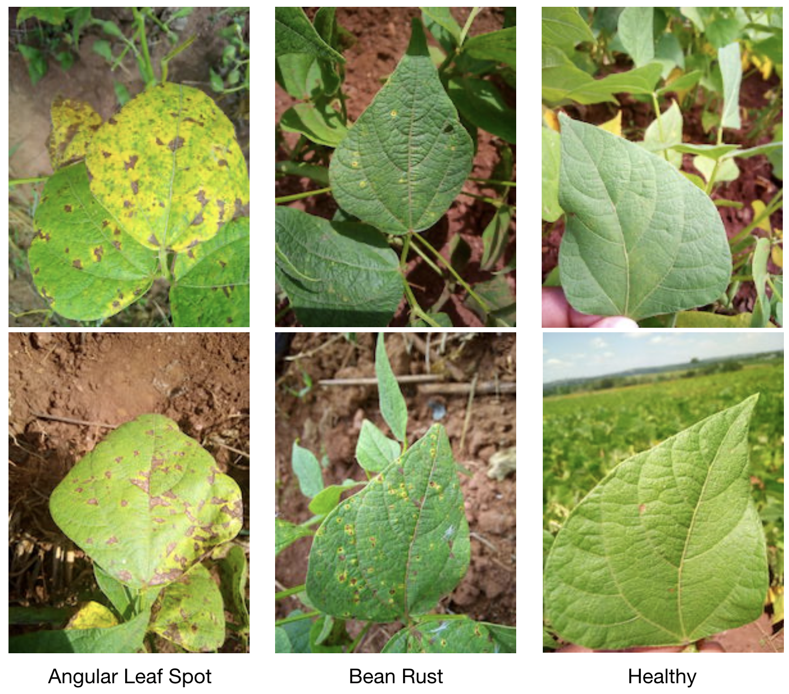

# ibean
Data repo for the ibean project of the AIR lab.

This dataset is of leaf images taken in the field in different districts in Uganda by the Makerere AI lab in collaboration with the National Crops Resources Research Institute (NaCRRI), the national body in charge of research in agriculture in Uganda. 

## The Machine Learning Challenge
The goal is to build a robust machine learning model that is able to distinguish between diseases in the Bean plants. Beans are an important cereal food crop for Africa grown by many small-holder farmers - they are a significant source of proteins for school-age going children in East Africa.  
<!---->

The data is of leaf images representing 3 classes: the healthy class of images, and two disease classes including Angular Leaf Spot and Bean Rust diseases. The model should be able to distinguish between these 3 classes with high accuracy. The end goal is to build a robust, model that can be deployed on a mobile device and used in the field by a farmer.

## The Data
The data includes leaf images taken in the field. The figure above depicts examples of the types of images per class. Images were taken from the field/garden a basic smartphone. 

The images were then annotated by experts from NaCRRI who determined for each image which disease was manifested. The experts were part of the data collection team and images were annotated directly during the data collection process in the field.

|Class|Examples|
|---|---|
Healthy class| 428|
Angular Leaf Spot| 432|
Bean Rust| 436|
Total:| 1,296

Data can be downloaded from here: [Train](https://storage.googleapis.com/ibeans/train.zip), [Validation](https://storage.googleapis.com/ibeans/validation.zip), [Test](https://storage.googleapis.com/ibeans/test.zip).

Now also available [here on huggingface](https://huggingface.co/datasets/beans).

### Versions/Release
|||
|----|---------------|
Data Released| 20-January-2020|
License | MIT|
Credits|  Makerere AI Lab|
